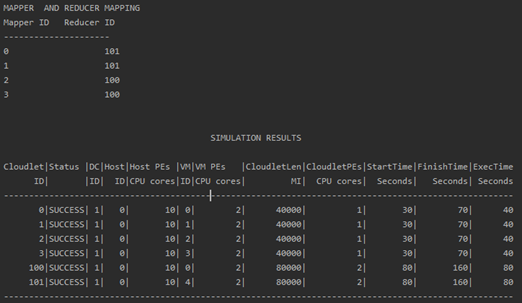
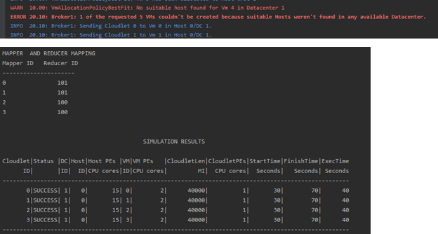
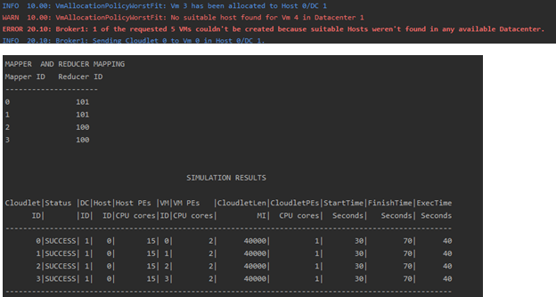
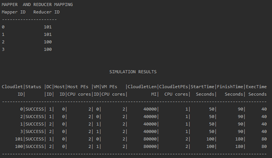
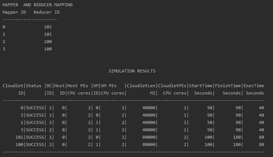
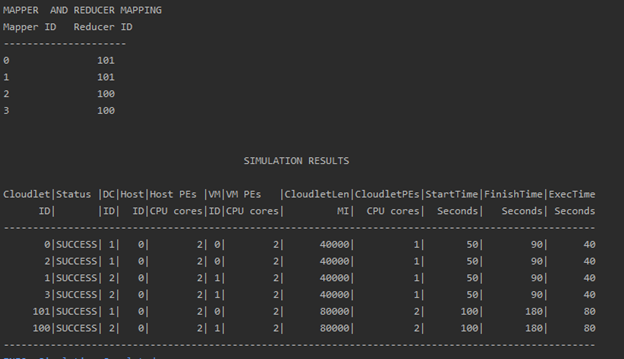

# Cloud Model Simulations 
The project simulates the working of datacenters and its components. The project has been developed on top of ***Cloudsim Plus*** framework and has been developed in java. We implement different scheduling and allocation policies of VMs and Hosts and Processes and observe the difference in execution time of jobs by changing various configuration parameters. Additionally, we discuss map reduce implementation design on top of the framework.

## Cloud Infrastructure
A cloud infrastructure comprises of multiple datacenters. Every datacenter consists of multiple hosts with processing elements. Processing elements have attributes like RAM, Processor Clock Cycle, etc. A Host can have multiple PEs with different configurations. Bases on the client's requriements VMs are created on top these hosts. The hosts are allocated based on the compatibility between the VM and Host. The jobs are executed in these VMS. There are multiple allocation policies which can be used to allocate VMs to Hosts and multiple scheduling policies which determine how to schedule jobs on these VMs.

## Cloud Sim Plus Framework
CloudSim Plus is a full-featured, highly extensible simulation framework enabling modeling, simulation, and experimentation of Cloud computing infrastructures and application services. It allows users to focus on specific system design issues to be investigated, without concerning the low-level details related to Cloud-based infrastructures and services. You can learn more about cloudsim plus at the [link](http://cloudsimplus.org/). The framework is open source and the code can be accessed at its [Github Repository](https://github.com/manoelcampos/cloudsim-plus).

## Setting up the environment
Clone Project using command 
```sh
git clone https://github.com/ajithnair20/Cloud-Model-Simulations.git
```
Navigate to folder "Ajith_Nair_hw1" from command line
```sh
$ cd Ajith_Nair_hw1
```

Build the project using the below command
```sh
$ gradle clean build
```

Run Test cases of the project using the below command
```sh
$ gradle test
```
The report of test cases execution is stored at path ***~\build\reports\tests\test\index.html***.

The application has 5 simulatiuons. ***Booter.java*** has been set as the main class in gradle. To run the simulations, exceute the following command:

```sh
$ gradle run --args '<simulation_no>'
```
For e.g. to execute simulation 4 we would run the command ***gradle run --args '4'***

## Observations

The configuration details for each simulation is as mentioned below:
| CONFIGURATION PARAMETERS        | SIMULATION 0-3           | SIMULATION 4-6  |
| ------------- |:-------------:| -----:|
| col 3 is      | right-aligned | $1600 |
| col 2 is      | centered      |   $12 |
| zebra stripes | are neat      |    $1 |
| Number of Datacenters | 1 | 1 |
| Number of Mappers | 4 | 4 |
| Number of Reducers | 2 | 2 |
| Number of VMs | 5 | 5 |
| Number of Hosts | 1 | 1 |
| Cost of Operation Per Sec | 3 | 3 |
| Cost Per Memory | 0.05 | 0.05 |
| Cost Per Storage: | 0.1 | 0.1 |
| Cost Per Bandwidth | 0.1 | 0.1 |
| VM Scheduling Policy | Time Shared | Time Shared |
| Cloudlet Scheduling Policy | Time Shared | Time Shared |
| Network Topology |  | Mesh |
| Network Bandwidth | 10 | 10 |
| Network Latency | 10 | 10 |

##### Simulation 0:
The VM allocation policy implement is “Simple Allocation”. Execution results are as mentioned below.



##### Simulation 1:
The VM allocation policy implement is “Round Robin Allocation”. Execution results are as mentioned below.


 
##### Simulation 2:
The VM allocation policy implement is “Best Fit Allocation”. Execution results are as mentioned below.



##### Simulation 3:
The VM allocation policy implement is “Worst Fit Allocation”. Execution results are as mentioned below.



##### Simulation 4:
The VM allocation policy implement is “Round Robin Allocation”. Execution results are as mentioned below.



##### Simulation 5:
The VM allocation policy implement is “Best Fit Allocation”. Execution results are as mentioned below.



##### Simulation 6:
The VM allocation policy implement is “Worst Fit Allocation”. Execution results are as mentioned below.


 

In the simulation 0 and 1, the simulations run perfectly fine. While in the simulations 2 and 3 for the same configuration, the scheduling of VMs to the host failed due to memory or storage insufficiency. Thus, we conclude that Round Robin and Simple Allocation policies are better than the Best-Fit and the Worst-Fit allocation policies. We also observe that placement of mappers and reducers on different datacenters affect the start time of execution of the reducers. There is a delay involved due to overhead of communication between the datacenters.

## Map Reduce Implementation Design
The architecture of the application consists of Mappers and Reducers and a Master to coordinate execution of mappers and reducers. Mappers and Reducers have been implemented by extending the CloudletSimple Class. Master class maintains a Hashtable mapperReducerMapping which includes mapping of Mappers and Reducers in the system. The application has been designed such that every reducer is mapped to two mappers. Every Mapper is bound with addOnFinishListener() listener which is invoked on the completion of execution of each Mapper. This listener includes invocation call to the method executeReduce () which spawns the creation of corresponding Reducer. The newly created Reducer is submitted dynamically for execution. Depending on the configuration, the reducers are either submitted to the same Datacenter as that of mapper or is submitted to a different Datacenter.